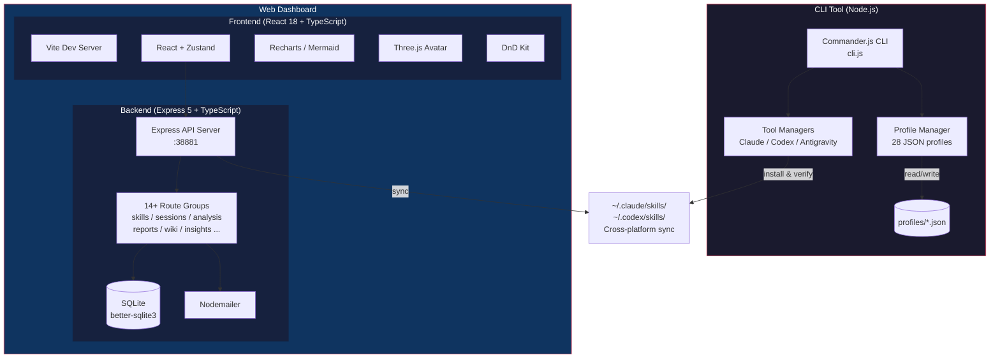

# Moyin Dev Dashboard

[](LICENSE)
[](https://nodejs.org/)
[](https://www.typescriptlang.org/)
[](https://react.dev/)
[](https://github.com/AtsushiHarimoto/Moyin-Factory)

A full-stack developer workflow dashboard combining a **CLI profile manager** for AI coding assistants (Claude Code, Codex, Antigravity) with a **React + Express web dashboard** for session analytics, skills management, and development insights.

---

## Architecture



## Key Features

### CLI Tool (`cli.js` + `lib/`)

- **Profile-based configuration** -- 28 pre-built JSON profiles across 3 AI tools (Claude Code, Codex, Antigravity) with 9 modes each (full, frontend-dev, backend-dev, review, design, QA, CI/CD, PRD, game)
- **Cross-platform sync** -- Bidirectional skills synchronization between macOS and Windows environments via `ss env-sync`
- **Smart switching** -- Switch a single tool or all tools at once with `ss use --all`, with automatic backup and rollback support
- **Common skills pinning** -- Shared skill sets always loaded regardless of active profile
- **Plugin management** -- List, restore, and manage Claude Code plugins

### Web Dashboard (`gui/`)

- **Session analytics** -- Track and visualize Claude Code / Codex session data with Recharts
- **Skills manager** -- Drag-and-drop skill ordering, sync status, installation verification
- **Development insights** -- AI-powered analysis of coding patterns and productivity
- **Report generation** -- Export session reports with email delivery via Nodemailer
- **Wiki system** -- Built-in knowledge base with Markdown rendering
- **3D avatar** -- Three.js + React Three Fiber animated assistant
- **i18n ready** -- Internationalization support
- **E2E tested** -- Playwright test suite for critical flows

## Tech Stack

| Layer | Technologies |
|-------|-------------|
| **CLI** | Node.js, Commander.js, Inquirer, Chalk, Ora, cli-table3 |
| **Frontend** | React 18, TypeScript, Vite, Zustand, TanStack Query, Recharts, Mermaid, Three.js, React Three Fiber, Framer Motion, DnD Kit, Tailwind CSS |
| **Backend** | Express 5, TypeScript, better-sqlite3, Nodemailer, tsx |
| **Testing** | Mocha (CLI), Vitest (frontend), Playwright (E2E) |

## Quick Start

### Prerequisites

- Node.js >= 18
- npm or pnpm

### CLI Tool

```bash
# Install dependencies
npm install

# Initialize configuration
node cli.js init

# List available profiles
node cli.js list

# Switch to a profile
node cli.js use cc-frontend-dev

# Switch all tools to the same mode
node cli.js use review --all

# Check current status
node cli.js status

# Cross-platform sync (project <-> global)
node cli.js env-sync

# Install shell alias for quick access
node cli.js alias install
# Then use: ss use cc-full
```

### Web Dashboard

```bash
cd gui

# Install dependencies
npm install

# Start both frontend and backend
npm run dev:all

# Or start individually:
npm run dev      # Frontend on http://localhost:38880
npm run server   # Backend on http://localhost:38881
```

### Global Installation (optional)

```bash
npm link
# Now available globally:
skills-switch list
ss status
```

## Project Structure

```
moyin-dev-dashboard/
├── cli.js                  # CLI entry point
├── lib/                    # CLI core modules
│   ├── main.js             # SkillsSwitch orchestrator
│   ├── profile-manager.js  # Profile CRUD operations
│   ├── claude-manager.js   # Claude Code integration
│   ├── codex-manager.js    # Codex integration
│   ├── anti-manager.js     # Antigravity integration
│   ├── base-manager.js     # Shared manager logic
│   ├── validators.js       # Input validation
│   ├── error-handler.js    # Centralized error handling
│   ├── logger.js           # Structured logging
│   └── ui.js               # Terminal UI helpers
├── profiles/               # 28 JSON profile configurations
├── config/                 # App configuration
├── test/                   # CLI test suite (Mocha)
├── doc/                    # Documentation
└── gui/                    # Web Dashboard
    ├── src/                # React frontend
    │   ├── components/     # UI components
    │   │   ├── skills/     # Skills management views
    │   │   ├── sessions/   # Session analytics views
    │   │   ├── dashboard/  # Dashboard widgets
    │   │   ├── insights/   # AI insights views
    │   │   ├── reports/    # Report generation
    │   │   ├── wiki/       # Knowledge base
    │   │   ├── issues/     # Issue tracker
    │   │   ├── progress/   # Progress tracking
    │   │   └── settings/   # App settings
    │   ├── stores/         # Zustand state management
    │   ├── hooks/          # Custom React hooks
    │   ├── i18n/           # Internationalization
    │   └── types/          # TypeScript type definitions
    ├── server/             # Express backend
    │   ├── routes/         # API route handlers
    │   │   ├── skills.ts
    │   │   ├── sessions.ts
    │   │   ├── analysis.ts
    │   │   ├── reports.ts
    │   │   ├── insights.ts
    │   │   ├── wiki.ts
    │   │   ├── issues.ts
    │   │   ├── dashboard.ts
    │   │   ├── progress.ts
    │   │   ├── keywords.ts
    │   │   ├── messages.ts
    │   │   ├── email.ts
    │   │   ├── export.ts
    │   │   └── sync.ts
    │   ├── services/       # Business logic
    │   ├── analysis/       # Data analysis modules
    │   ├── database.ts     # SQLite connection
    │   └── utils/          # Server utilities
    ├── e2e/                # Playwright E2E tests
    └── public/             # Static assets
```

## CLI Commands

| Command | Description |
|---------|-------------|
| `ss init` | Initialize configuration |
| `ss list` | List all available profiles |
| `ss use <profile>` | Switch to a profile |
| `ss use <mode> --all` | Switch all tools to a mode |
| `ss status` | Show current active profiles |
| `ss diff <profile>` | Compare current vs. a profile |
| `ss backup` | Backup current configuration |
| `ss restore [id]` | Restore from backup |
| `ss rollback` | Rollback to previous profile |
| `ss sync [profile]` | Sync current skills to a profile |
| `ss env-sync` | Cross-platform environment sync |
| `ss common list` | List always-loaded common skills |
| `ss common add <skill>` | Add skill to common set |
| `ss plugins list` | List Claude Code plugins |
| `ss plugins restore` | Restore all plugins |
| `ss alias install` | Install shell alias |

## API Endpoints

The Express backend serves 14+ route groups on port `38881`:

- `GET/POST /api/skills/*` -- Skills CRUD and sync
- `GET/POST /api/sessions/*` -- Session tracking and analytics
- `GET /api/analysis/*` -- Code analysis and metrics
- `GET/POST /api/reports/*` -- Report generation and export
- `GET /api/insights/*` -- AI-powered development insights
- `GET/POST /api/wiki/*` -- Knowledge base management
- `GET/POST /api/issues/*` -- Issue tracking
- `GET /api/dashboard/*` -- Dashboard aggregated data
- `GET /api/progress/*` -- Progress tracking
- `POST /api/email/*` -- Email delivery
- `GET /api/export/*` -- Data export
- `POST /api/sync/*` -- Data synchronization
- `GET /api/keywords/*` -- Keyword analysis
- `GET /api/messages/*` -- Message history

## Design Decisions

1. **Profile-based configuration over per-file editing** -- Managing AI tool skills through named profiles (e.g., `cc-frontend-dev`, `cx-review`) provides reproducible setups and instant context switching instead of manual file manipulation.

2. **Cross-platform sync as a first-class feature** -- Developers working across macOS and Windows need seamless skills portability. The `env-sync` command handles path differences and bidirectional synchronization transparently.

3. **Separate CLI + Web Dashboard** -- The CLI enables fast terminal-based workflows; the web dashboard adds visualization, drag-and-drop management, and analytics that terminals cannot provide. Both share the same underlying data.

4. **SQLite for local-first storage** -- Using `better-sqlite3` keeps the dashboard self-contained with zero external database dependencies while providing reliable structured data storage.

5. **Express 5 with TypeScript** -- Type-safe backend with the latest Express version ensures maintainability and catches errors at compile time.

## Part of the Moyin Ecosystem

This project is part of [**Moyin Factory**](https://github.com/AtsushiHarimoto/Moyin-Factory) -- a collection of developer tools, visual novel engines, and creative coding projects.

| Project | Description |
|---------|-------------|
| [Moyin Factory](https://github.com/AtsushiHarimoto/Moyin-Factory) | Monorepo and ecosystem hub |
| **Moyin Dev Dashboard** | This project -- CLI + Web dashboard for AI dev workflows |

## License

[MIT](LICENSE) -- Copyright (c) 2025-2026 Atsushi Harimoto

---

# 日本語

## Moyin Dev Dashboard

AI コーディングアシスタント（Claude Code、Codex、Antigravity）向けの**CLIプロファイルマネージャー**と、セッション分析・スキル管理・開発インサイトのための**React + Express Webダッシュボード**を組み合わせた、フルスタック開発者ワークフローダッシュボードです。

### 主な機能

- **プロファイルベースの設定管理** -- 3つのAIツール x 9モード = 28のJSONプロファイルで瞬時にコンテキスト切り替え
- **クロスプラットフォーム同期** -- macOSとWindows間でスキル設定を双方向同期
- **Webダッシュボード** -- React 18 + Express 5によるセッション分析、スキル管理、レポート生成
- **3Dアバター** -- Three.js + React Three Fiberによるアニメーションアシスタント
- **E2Eテスト** -- Playwrightによる品質保証

### クイックスタート

```bash
# CLI ツール
npm install
node cli.js init
node cli.js use cc-frontend-dev

# Web ダッシュボード
cd gui && npm install && npm run dev:all
```

### 技術スタック

CLI: Node.js, Commander.js | フロントエンド: React 18, TypeScript, Vite, Zustand, Recharts, Three.js | バックエンド: Express 5, TypeScript, SQLite | テスト: Mocha, Vitest, Playwright

---

# 繁體中文

## Moyin Dev Dashboard

結合 **CLI 設定檔管理器**（支援 Claude Code、Codex、Antigravity）與 **React + Express Web 儀表板**（提供工作階段分析、技能管理、開發洞察）的全端開發者工作流儀表板。

### 主要功能

- **基於設定檔的組態管理** -- 3 個 AI 工具 x 9 種模式 = 28 個 JSON 設定檔，實現即時情境切換
- **跨平台同步** -- macOS 與 Windows 之間雙向同步技能設定
- **Web 儀表板** -- React 18 + Express 5 驅動的工作階段分析、技能管理、報告產生
- **3D 虛擬形象** -- Three.js + React Three Fiber 動畫助手
- **E2E 測試** -- Playwright 品質保證

### 快速開始

```bash
# CLI 工具
npm install
node cli.js init
node cli.js use cc-frontend-dev

# Web 儀表板
cd gui && npm install && npm run dev:all
```

### 技術堆疊

CLI: Node.js, Commander.js | 前端: React 18, TypeScript, Vite, Zustand, Recharts, Three.js | 後端: Express 5, TypeScript, SQLite | 測試: Mocha, Vitest, Playwright

---

Built with TypeScript across the entire stack.
