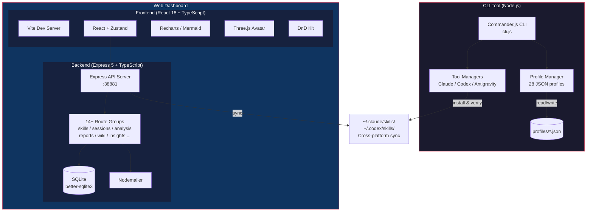

# Moyin Dev Dashboard

> **Languages:** [English](../README.md) | [日本語](README.ja.md) | [繁體中文](README.zh-TW.md)

[](../LICENSE)
[](https://nodejs.org/)
[](https://www.typescriptlang.org/)
[](https://react.dev/)
[](https://github.com/AtsushiHarimoto/Moyin-Factory)

AIコーディングアシスタント（Claude Code、Codex、Antigravity）向けの**CLIプロファイルマネージャー**と、セッション分析・スキル管理・開発インサイトのための**React + Express Webダッシュボード**を組み合わせた、フルスタック開発者ワークフローダッシュボードです。

---

## アーキテクチャ



## 主な機能

### CLIツール (`cli.js` + `lib/`)

- **プロファイルベースの設定管理** -- 3つのAIツール（Claude Code、Codex、Antigravity）にわたる28のビルド済みJSONプロファイル。各ツール9モード（full、frontend-dev、backend-dev、review、design、QA、CI/CD、PRD、game）対応
- **クロスプラットフォーム同期** -- `ss env-sync` によるmacOS・Windows間の双方向スキル同期
- **スマート切り替え** -- `ss use --all` で単一ツールまたは全ツールを一括切り替え。自動バックアップとロールバック機能付き
- **共通スキルの固定** -- アクティブプロファイルに関係なく常にロードされる共有スキルセット
- **プラグイン管理** -- Claude Codeプラグインの一覧表示、復元、管理

### Webダッシュボード (`gui/`)

- **セッション分析** -- Rechartsを使用してClaude Code / Codexのセッションデータを追跡・可視化
- **スキルマネージャー** -- ドラッグ&ドロップによるスキル並べ替え、同期状態の確認、インストール検証
- **開発インサイト** -- AIを活用したコーディングパターンと生産性の分析
- **レポート生成** -- Nodemailerによるメール配信付きセッションレポートのエクスポート
- **Wikiシステム** -- Markdownレンダリング対応の組み込みナレッジベース
- **3Dアバター** -- Three.js + React Three Fiberによるアニメーションアシスタント
- **i18n対応** -- 国際化サポート
- **E2Eテスト済み** -- 重要なフローに対するPlaywrightテストスイート

## 技術スタック

| レイヤー | 技術 |
|----------|------|
| **CLI** | Node.js, Commander.js, Inquirer, Chalk, Ora, cli-table3 |
| **フロントエンド** | React 18, TypeScript, Vite, Zustand, TanStack Query, Recharts, Mermaid, Three.js, React Three Fiber, Framer Motion, DnD Kit, Tailwind CSS |
| **バックエンド** | Express 5, TypeScript, better-sqlite3, Nodemailer, tsx |
| **テスト** | Mocha (CLI), Vitest (フロントエンド), Playwright (E2E) |

## クイックスタート

### 前提条件

- Node.js >= 18
- npm または pnpm

### CLIツール

```bash
# 依存関係のインストール
npm install

# 設定の初期化
node cli.js init

# 利用可能なプロファイルの一覧表示
node cli.js list

# プロファイルの切り替え
node cli.js use cc-frontend-dev

# 全ツールを同じモードに切り替え
node cli.js use review --all

# 現在のステータスを確認
node cli.js status

# クロスプラットフォーム同期（プロジェクト <-> グローバル）
node cli.js env-sync

# シェルエイリアスをインストールしてクイックアクセス
node cli.js alias install
# 以降は ss use cc-full で利用可能
```

### Webダッシュボード

```bash
cd gui

# 依存関係のインストール
npm install

# フロントエンドとバックエンドを同時に起動
npm run dev:all

# 個別に起動する場合：
npm run dev      # フロントエンド: http://localhost:38880
npm run server   # バックエンド: http://localhost:38881
```

### グローバルインストール（任意）

```bash
npm link
# グローバルコマンドとして利用可能に：
skills-switch list
ss status
```

## プロジェクト構成

```
moyin-dev-dashboard/
├── cli.js                  # CLIエントリーポイント
├── lib/                    # CLIコアモジュール
│   ├── main.js             # SkillsSwitchオーケストレーター
│   ├── profile-manager.js  # プロファイルCRUD操作
│   ├── claude-manager.js   # Claude Code連携
│   ├── codex-manager.js    # Codex連携
│   ├── anti-manager.js     # Antigravity連携
│   ├── base-manager.js     # 共有マネージャーロジック
│   ├── validators.js       # 入力バリデーション
│   ├── error-handler.js    # 集中エラーハンドリング
│   ├── logger.js           # 構造化ログ
│   └── ui.js               # ターミナルUIヘルパー
├── profiles/               # 28のJSONプロファイル設定
├── config/                 # アプリ設定
├── test/                   # CLIテストスイート（Mocha）
├── doc/                    # ドキュメント
└── gui/                    # Webダッシュボード
    ├── src/                # Reactフロントエンド
    │   ├── components/     # UIコンポーネント
    │   │   ├── skills/     # スキル管理ビュー
    │   │   ├── sessions/   # セッション分析ビュー
    │   │   ├── dashboard/  # ダッシュボードウィジェット
    │   │   ├── insights/   # AIインサイトビュー
    │   │   ├── reports/    # レポート生成
    │   │   ├── wiki/       # ナレッジベース
    │   │   ├── issues/     # イシュートラッカー
    │   │   ├── progress/   # 進捗追跡
    │   │   └── settings/   # アプリ設定
    │   ├── stores/         # Zustand状態管理
    │   ├── hooks/          # カスタムReactフック
    │   ├── i18n/           # 国際化
    │   └── types/          # TypeScript型定義
    ├── server/             # Expressバックエンド
    │   ├── routes/         # APIルートハンドラー
    │   │   ├── skills.ts
    │   │   ├── sessions.ts
    │   │   ├── analysis.ts
    │   │   ├── reports.ts
    │   │   ├── insights.ts
    │   │   ├── wiki.ts
    │   │   ├── issues.ts
    │   │   ├── dashboard.ts
    │   │   ├── progress.ts
    │   │   ├── keywords.ts
    │   │   ├── messages.ts
    │   │   ├── email.ts
    │   │   ├── export.ts
    │   │   └── sync.ts
    │   ├── services/       # ビジネスロジック
    │   ├── analysis/       # データ分析モジュール
    │   ├── database.ts     # SQLite接続
    │   └── utils/          # サーバーユーティリティ
    ├── e2e/                # Playwright E2Eテスト
    └── public/             # 静的アセット
```

## CLIコマンド

| コマンド | 説明 |
|----------|------|
| `ss init` | 設定の初期化 |
| `ss list` | 利用可能な全プロファイルの一覧表示 |
| `ss use <profile>` | プロファイルの切り替え |
| `ss use <mode> --all` | 全ツールを指定モードに切り替え |
| `ss status` | 現在のアクティブプロファイルを表示 |
| `ss diff <profile>` | 現在の設定とプロファイルの比較 |
| `ss backup` | 現在の設定をバックアップ |
| `ss restore [id]` | バックアップからの復元 |
| `ss rollback` | 前のプロファイルにロールバック |
| `ss sync [profile]` | 現在のスキルをプロファイルに同期 |
| `ss env-sync` | クロスプラットフォーム環境同期 |
| `ss common list` | 常時ロードされる共通スキルの一覧表示 |
| `ss common add <skill>` | 共通スキルセットにスキルを追加 |
| `ss plugins list` | Claude Codeプラグインの一覧表示 |
| `ss plugins restore` | 全プラグインの復元 |
| `ss alias install` | シェルエイリアスのインストール |

## APIエンドポイント

Expressバックエンドはポート `38881` で14以上のルートグループを提供します：

- `GET/POST /api/skills/*` -- スキルのCRUDと同期
- `GET/POST /api/sessions/*` -- セッションの追跡と分析
- `GET /api/analysis/*` -- コード分析とメトリクス
- `GET/POST /api/reports/*` -- レポートの生成とエクスポート
- `GET /api/insights/*` -- AI搭載の開発インサイト
- `GET/POST /api/wiki/*` -- ナレッジベース管理
- `GET/POST /api/issues/*` -- イシュー追跡
- `GET /api/dashboard/*` -- ダッシュボード集約データ
- `GET /api/progress/*` -- 進捗追跡
- `POST /api/email/*` -- メール配信
- `GET /api/export/*` -- データエクスポート
- `POST /api/sync/*` -- データ同期
- `GET /api/keywords/*` -- キーワード分析
- `GET /api/messages/*` -- メッセージ履歴

## 設計上の決定

1. **ファイル個別編集よりプロファイルベースの設定管理** -- AIツールのスキルを名前付きプロファイル（例：`cc-frontend-dev`、`cx-review`）で管理することにより、手動のファイル操作の代わりに再現可能なセットアップと瞬時のコンテキスト切り替えを実現しています。

2. **ファーストクラス機能としてのクロスプラットフォーム同期** -- macOSとWindowsを跨いで作業する開発者にとって、シームレスなスキルの移植性が必要です。`env-sync` コマンドはパスの違いや双方向同期を透過的に処理します。

3. **CLI + Webダッシュボードの分離** -- CLIは高速なターミナルベースのワークフローを可能にし、Webダッシュボードはターミナルでは実現できない可視化、ドラッグ&ドロップ管理、分析機能を追加します。両方とも同じ基盤データを共有しています。

4. **ローカルファーストストレージとしてのSQLite** -- `better-sqlite3` を使用することで、外部データベース依存なしの自己完結型ダッシュボードを実現し、信頼性の高い構造化データストレージを提供します。

5. **TypeScript付きExpress 5** -- 最新バージョンのExpressによる型安全なバックエンドにより、保守性を確保し、コンパイル時にエラーを検出します。

## Moyinエコシステムの一部

このプロジェクトは [**Moyin Factory**](https://github.com/AtsushiHarimoto/Moyin-Factory) の一部です -- 開発者ツール、ビジュアルノベルエンジン、クリエイティブコーディングプロジェクトのコレクションです。

| プロジェクト | 説明 |
|------------|------|
| [Moyin Factory](https://github.com/AtsushiHarimoto/Moyin-Factory) | モノレポ・エコシステムハブ |
| **Moyin Dev Dashboard** | 本プロジェクト -- AI開発ワークフロー向けCLI + Webダッシュボード |

## ライセンス

[MIT](../LICENSE) -- Copyright (c) 2025-2026 Atsushi Harimoto
