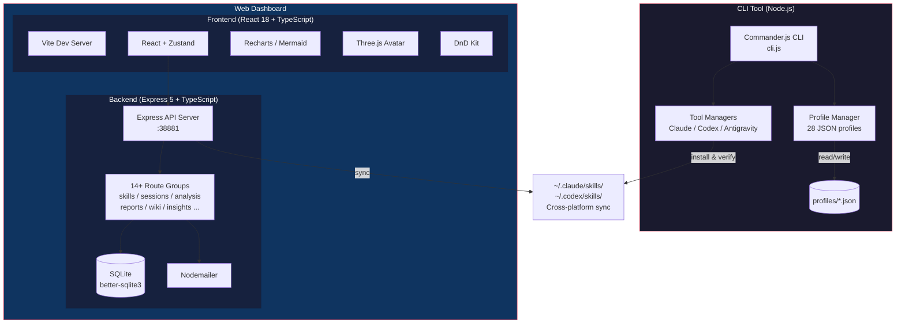

# Moyin Dev Dashboard

> **Languages:** [English](../README.md) | [日本語](README.ja.md) | [繁體中文](README.zh-TW.md)

[](../LICENSE)
[](https://nodejs.org/)
[](https://www.typescriptlang.org/)
[](https://react.dev/)
[](https://github.com/AtsushiHarimoto/Moyin-Factory)

結合 **CLI 設定檔管理器**（支援 Claude Code、Codex、Antigravity）與 **React + Express Web 儀表板**（提供工作階段分析、技能管理、開發洞察）的全端開發者工作流儀表板。

---

## 架構



## 主要功能

### CLI 工具 (`cli.js` + `lib/`)

- **基於設定檔的組態管理** -- 橫跨 3 個 AI 工具（Claude Code、Codex、Antigravity）的 28 個預建 JSON 設定檔，每個工具支援 9 種模式（full、frontend-dev、backend-dev、review、design、QA、CI/CD、PRD、game）
- **跨平台同步** -- 透過 `ss env-sync` 實現 macOS 與 Windows 之間的雙向技能同步
- **智慧切換** -- 使用 `ss use --all` 一次切換單一工具或所有工具，支援自動備份與回滾
- **共用技能釘選** -- 無論目前使用哪個設定檔，共享技能集始終保持載入
- **外掛管理** -- 列出、還原和管理 Claude Code 外掛

### Web 儀表板 (`gui/`)

- **工作階段分析** -- 使用 Recharts 追蹤與視覺化 Claude Code / Codex 工作階段資料
- **技能管理器** -- 拖放排序技能、同步狀態確認、安裝驗證
- **開發洞察** -- AI 驅動的編碼模式與生產力分析
- **報告產生** -- 透過 Nodemailer 匯出附帶電子郵件傳送的工作階段報告
- **Wiki 系統** -- 內建支援 Markdown 渲染的知識庫
- **3D 虛擬形象** -- Three.js + React Three Fiber 動畫助手
- **i18n 支援** -- 國際化功能
- **E2E 測試** -- 針對關鍵流程的 Playwright 測試套件

## 技術堆疊

| 層級 | 技術 |
|------|------|
| **CLI** | Node.js, Commander.js, Inquirer, Chalk, Ora, cli-table3 |
| **前端** | React 18, TypeScript, Vite, Zustand, TanStack Query, Recharts, Mermaid, Three.js, React Three Fiber, Framer Motion, DnD Kit, Tailwind CSS |
| **後端** | Express 5, TypeScript, better-sqlite3, Nodemailer, tsx |
| **測試** | Mocha (CLI), Vitest (前端), Playwright (E2E) |

## 快速開始

### 前置需求

- Node.js >= 18
- npm 或 pnpm

### CLI 工具

```bash
# 安裝依賴
npm install

# 初始化設定
node cli.js init

# 列出可用設定檔
node cli.js list

# 切換設定檔
node cli.js use cc-frontend-dev

# 將所有工具切換至相同模式
node cli.js use review --all

# 檢查目前狀態
node cli.js status

# 跨平台同步（專案 <-> 全域）
node cli.js env-sync

# 安裝 shell 別名以快速存取
node cli.js alias install
# 之後可使用：ss use cc-full
```

### Web 儀表板

```bash
cd gui

# 安裝依賴
npm install

# 同時啟動前端與後端
npm run dev:all

# 或分別啟動：
npm run dev      # 前端：http://localhost:38880
npm run server   # 後端：http://localhost:38881
```

### 全域安裝（選用）

```bash
npm link
# 現在可作為全域指令使用：
skills-switch list
ss status
```

## 專案結構

```
moyin-dev-dashboard/
├── cli.js                  # CLI 進入點
├── lib/                    # CLI 核心模組
│   ├── main.js             # SkillsSwitch 協調器
│   ├── profile-manager.js  # 設定檔 CRUD 操作
│   ├── claude-manager.js   # Claude Code 整合
│   ├── codex-manager.js    # Codex 整合
│   ├── anti-manager.js     # Antigravity 整合
│   ├── base-manager.js     # 共享管理器邏輯
│   ├── validators.js       # 輸入驗證
│   ├── error-handler.js    # 集中式錯誤處理
│   ├── logger.js           # 結構化日誌
│   └── ui.js               # 終端 UI 輔助工具
├── profiles/               # 28 個 JSON 設定檔
├── config/                 # 應用程式設定
├── test/                   # CLI 測試套件（Mocha）
├── doc/                    # 文件
└── gui/                    # Web 儀表板
    ├── src/                # React 前端
    │   ├── components/     # UI 元件
    │   │   ├── skills/     # 技能管理檢視
    │   │   ├── sessions/   # 工作階段分析檢視
    │   │   ├── dashboard/  # 儀表板小工具
    │   │   ├── insights/   # AI 洞察檢視
    │   │   ├── reports/    # 報告產生
    │   │   ├── wiki/       # 知識庫
    │   │   ├── issues/     # 問題追蹤器
    │   │   ├── progress/   # 進度追蹤
    │   │   └── settings/   # 應用程式設定
    │   ├── stores/         # Zustand 狀態管理
    │   ├── hooks/          # 自訂 React Hooks
    │   ├── i18n/           # 國際化
    │   └── types/          # TypeScript 型別定義
    ├── server/             # Express 後端
    │   ├── routes/         # API 路由處理器
    │   │   ├── skills.ts
    │   │   ├── sessions.ts
    │   │   ├── analysis.ts
    │   │   ├── reports.ts
    │   │   ├── insights.ts
    │   │   ├── wiki.ts
    │   │   ├── issues.ts
    │   │   ├── dashboard.ts
    │   │   ├── progress.ts
    │   │   ├── keywords.ts
    │   │   ├── messages.ts
    │   │   ├── email.ts
    │   │   ├── export.ts
    │   │   └── sync.ts
    │   ├── services/       # 商業邏輯
    │   ├── analysis/       # 資料分析模組
    │   ├── database.ts     # SQLite 連線
    │   └── utils/          # 伺服器工具
    ├── e2e/                # Playwright E2E 測試
    └── public/             # 靜態資源
```

## CLI 指令

| 指令 | 說明 |
|------|------|
| `ss init` | 初始化設定 |
| `ss list` | 列出所有可用設定檔 |
| `ss use <profile>` | 切換至指定設定檔 |
| `ss use <mode> --all` | 將所有工具切換至指定模式 |
| `ss status` | 顯示目前使用中的設定檔 |
| `ss diff <profile>` | 比較目前設定與指定設定檔 |
| `ss backup` | 備份目前設定 |
| `ss restore [id]` | 從備份還原 |
| `ss rollback` | 回滾至前一個設定檔 |
| `ss sync [profile]` | 將目前技能同步至設定檔 |
| `ss env-sync` | 跨平台環境同步 |
| `ss common list` | 列出常駐載入的共用技能 |
| `ss common add <skill>` | 新增技能至共用集合 |
| `ss plugins list` | 列出 Claude Code 外掛 |
| `ss plugins restore` | 還原所有外掛 |
| `ss alias install` | 安裝 shell 別名 |

## API 端點

Express 後端在連接埠 `38881` 上提供 14 個以上的路由群組：

- `GET/POST /api/skills/*` -- 技能的 CRUD 與同步
- `GET/POST /api/sessions/*` -- 工作階段追蹤與分析
- `GET /api/analysis/*` -- 程式碼分析與指標
- `GET/POST /api/reports/*` -- 報告產生與匯出
- `GET /api/insights/*` -- AI 驅動的開發洞察
- `GET/POST /api/wiki/*` -- 知識庫管理
- `GET/POST /api/issues/*` -- 問題追蹤
- `GET /api/dashboard/*` -- 儀表板彙總資料
- `GET /api/progress/*` -- 進度追蹤
- `POST /api/email/*` -- 電子郵件傳送
- `GET /api/export/*` -- 資料匯出
- `POST /api/sync/*` -- 資料同步
- `GET /api/keywords/*` -- 關鍵字分析
- `GET /api/messages/*` -- 訊息歷史

## 設計決策

1. **以設定檔為基礎的組態管理取代逐檔編輯** -- 透過命名設定檔（例如 `cc-frontend-dev`、`cx-review`）管理 AI 工具技能，提供可重現的配置和即時的情境切換，取代手動檔案操作。

2. **跨平台同步作為一級功能** -- 在 macOS 與 Windows 之間工作的開發者需要無縫的技能移植性。`env-sync` 指令透明地處理路徑差異和雙向同步。

3. **CLI + Web 儀表板分離** -- CLI 實現快速的終端工作流；Web 儀表板新增終端無法提供的視覺化、拖放管理和分析功能。兩者共享相同的基礎資料。

4. **SQLite 作為本地優先儲存** -- 使用 `better-sqlite3` 讓儀表板保持自足，零外部資料庫依賴，同時提供可靠的結構化資料儲存。

5. **搭配 TypeScript 的 Express 5** -- 採用最新版 Express 的型別安全後端，確保可維護性並在編譯時期捕捉錯誤。

## Moyin 生態系的一部分

本專案是 [**Moyin Factory**](https://github.com/AtsushiHarimoto/Moyin-Factory) 的一部分 -- 開發者工具、視覺小說引擎與創意編碼專案的集合。

| 專案 | 說明 |
|------|------|
| [Moyin Factory](https://github.com/AtsushiHarimoto/Moyin-Factory) | Monorepo 與生態系中樞 |
| **Moyin Dev Dashboard** | 本專案 -- AI 開發工作流的 CLI + Web 儀表板 |

## 授權條款

[MIT](../LICENSE) -- Copyright (c) 2025-2026 Atsushi Harimoto
